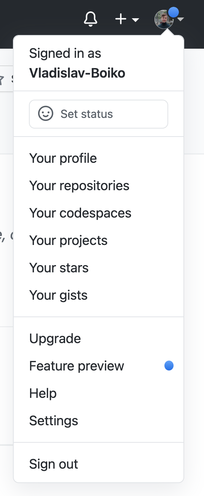
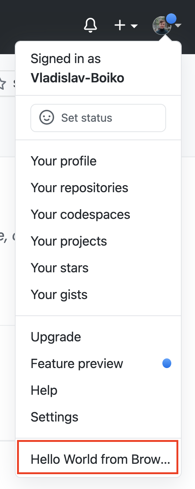
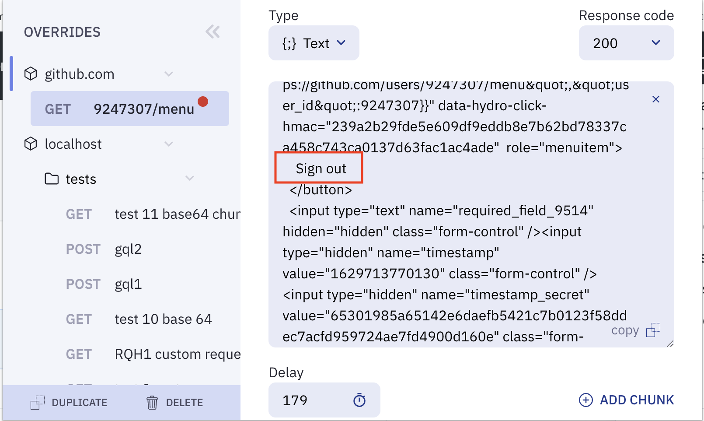
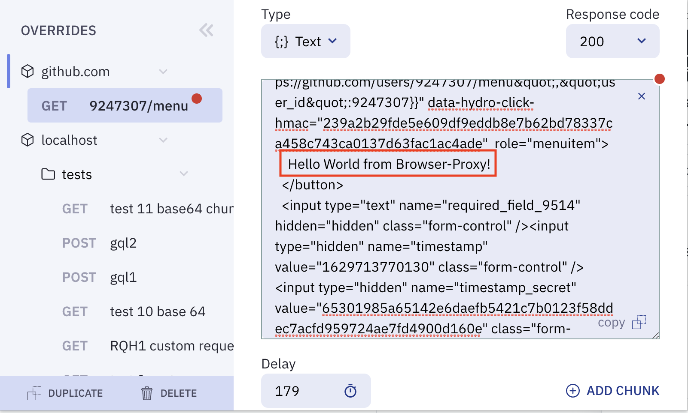

# Browser-proxy

Replace fetch, XMLHttpRequest, AJAX responses of any website on the fly without leaving the browser!

Table of contents:

- [Quick start](#Quick-start)
- [Overriding responses](#Overriding-responses)
  - [Overriding an existing request](#Overriding-an-existing-request)
  - [Creating a new Override](#Creating-a-new-Override)
    - [Matching the request to be overriden](#Matching-the-request-to-be-overriden)
    - [Changing the response of a request](#Changing-the-response-of-a-request)
- [Using variables for RegExp matching](#Using-variables-for-RegExp-matching)
- [Overrides priority](#Overrides-priority)
- [Import/Export and sharing overrides](#ImportExport-and-sharing-overrides)
- [Troubleshooting](#Troubleshooting)
- [Manual extension installation](#Manual-extension-installation)

## 🚀 Quick start

First activate the extension on your desired web page:

1.  ~~Install the browser-proxy chrome extension from chrome web-store.~~ Browser-proxy is not yet available in the chrome web-store (coming soon, is undergoing the review process now) [you can install it manually if you want to use it before that](#Manual-extension-installation).
2.  Go to a web page where you want to override a response.
3.  Click on the browser-proxy-chrome extension icon in the browser upper right corner:

    \
     

4.  Click on the Enable button:

    \
    

5.  Reload the page. The extension icon shall now be blue, indicating it is enabled on this page:

    \
     

🥳 You are all set, if the icon of the extension is blue, it is active on this web page. You can always turn it off for a certain page, buy toggling the "disable" toggle in it.

\


## Overriding responses

You can either change a response of an existing request, or mock a completely new one.
First open the the extension on the desired site ([how?](#Quick-start))

> 💡 **Hint** \
> Instead of always opening browser-proxy through the extension icon, you can open it in the developer tools. To open it open the Chrome Menu in the upper-right-hand corner of the browser window and select More Tools > Developer Tools, or use Option + ⌘ + J (on macOS), or Shift + CTRL + J (on Windows/Linux). There you shall be a tab 'browser-proxy', where you can access the extension.
>
> 

### Overriding an existing request

If a web-site is sending some ajax requests and you want to mock their response without leaving the browser, to, for instance, return a 404 instead of 200, or return another response, or return a response much slower or in chunks, you can create an override for this concrete request.

For example we will override an item in the user-menu on github. It is loaded via fetch, when one hovers with mouse own avatar on github in the top right of the screen.

<table border="0">
 <tr>
    <td><b>We will change this</b></td>
    <td><b>To this</b></td>
 </tr>
 <tr>
    <td></td>
    <td></td>
 </tr>
</table>

1. Choose the request you want, from the list of requests that were captured by the extension. Note, that static assets such as images or css files are not monitored by the extension.

   \
    

2. Click on the `Override` Button.

   \
    

3. The response tab of a request shall open, and there you can see the response for the fetch that loaded the menu:

   \
    

4. Modify the response to have something new it in. Here we change the "Sign out" text, to a "Hello World from Browser-Proxy!" text.

<table border="0" style="position: relative">
 <tr>
    <td><b>We will change this</b></td>
    <td><b>To this</b></td>
 </tr>
 <tr>
    <td></td>
    <td></td>
 </tr>
</table>

5. Click save.

   \
    

6. Resend the request to get the new response. In our case we have to reload the page and to click the avatar once again:
   \
   

### Creating a new Override

The extension tracks all ajax requests that were sent after its initialization on the page. When a request is sent, it checks if you have any overrides configured to capture this request and override its response. If yes, it does not send the real request to the server, but proxies it with the response defined in the override.

A pair of a request-matcher to response saved in the extension is called an override. The request matcher may be regexp based, and the response might have some parts of the request in it.

To create an override you have first to define what requests shall it capture, and then to define what response shall these requests proxy.

#### **Matching the request to be overriden**

To modify a response of some request the extension has to know what request it shall modify. To do that we have to capture the request in some `override`, by identifying the request method, url etc.

1. Go to a website where you want to create an override.
2. Click `add override`

   \
    

3. Go to request tab of the created override

   \
    

4. There give in the URL of a request you want to override:

   \
    

5. If you are sending some request body specify it in the request body section:

   \
    

6. If you are setting some request headers, also specify them in the Request headers section:

   \
    

> 💡 **Hint** \
> If you want some generic matching of the request parameters, in URL, body or headers you can use RegEp based variables mechanism that is described [in the next section](#Using-variables-for-RegExp-matching).

#### **Changing the response of a request**

If you want to change a response of some request, be it a real request sent to the server or a completely mocked one, you have to capture this request in some override, and modify its response in the extension as follows:

1. Go to the response tab:

   \
    

2. Modify the response you wat to get:

   \
    

3. You can also change the response code and the delay after which the response will be returned:

   \
    

4. If you want to return a file, choose the file return type, and either upload a file, or type in its bytes as a base64 encoded string.

   \
    

5. You can also add chunks to response body with separate delays. Then the overriden request will receive the response sequentially in this chunks. You can also join all chunks into one response.

   \
    

6. Define the response headers you want to receive:

   \
    

> 💡 **Hint** \
> If you want to use some part of a request as part of the response you can use the variable mechanism, to capture what use sent, and use it in the response. It can as well be use in the response body as well as in the response headers. See usage of variables [in the next section](#Using-variables-for-RegExp-matching).

## Using variables for RegExp matching

All variables are a pair of a variable-name and regexp behind it. They can be used to capture different requests with a single override, and to use parts of the requests in the responses.

Say you have a request for a url:

```js
  http://example.com/user/123
```

Where `123` is the id of a user. And you want to override all such requests for different ids with same override. Then you can create a variable with some arbitrary name, for instance `$id`, with a matching regexp `/\d+/`.

You can modify the request URL of your override tools

```js
  http://example.com/user/$id
```

And even use the captured `id` in the response:

```js
{
  id: $id;
}
```

Here is an example on how to create and use a variable:

1. Go to the variables tab:

   \
    

2. Create a variable:

   \
    

3. Use the variable somewhere in the request tab. You can use it anywhere in this tab - as part of the url, request body or some header.

   \
    

4. Now you can use the variable in the response tab:

   \
    

Thus all requests that were sent from this site to

```js
  http://example.com/user/\d+
```

Will be captured by this override, and will return the `id` in the response json.

> 💡 **Hint** \
> All variables are matched by their name exactly, you can choose anything, but to avoid some collisions with content in your regular requests, it is recommended to prefix all your variables with something that is unlikely to appear in them. In our examples we use `$` sign before the name of all variables.

## Overrides priority

In the overrides tree view you can see all the overrides you have within a tree view:

\
 

At the topmost level of the tree-view are always certain web-sites. The websites are identified by a url, including, if necessary port. Thus different localhost ports can be separated.

Overrides on every web-site can be enabled and disabled separately. For that select certain web-site in the tree-view and toggle the enable/disable button for it.

Every web-site might have subfolders, which might have subfolders as well. They are useful if you want to have overrides for different use-cases on the same site. For instance you might want to have several folders for `localhost:3000` for different projects.

Every folder as well as every request can be enabled and disabled separately. Same as with overrides for entire web-sites, to manage if they are enabled or disabled, select the desired element in the tree view and toggle the enable/disable button.

It might be that the same request can be matched by two overrides. The overrides are prioritized from top to bottom on every hierarchy level. It means that first all the overrides in the upper-most folder will be checked from top to bottom, then in the first subfolder and so on.

You can move the overrides or folders with drag and drop within the tree view. As well as copy and delete them.

Variables in the parent folder are shared by all overrides underneath, but can be overriden by a subfolder or an override own variable with the same name.

## Import/Export and sharing overrides

Overrides on a certain web-site or a certain folder, can be imported and exported into a json file. This file can then be shared or placed in some VCS (git/svn etc.)

\
 

Hit the export button, and you will have a json file being downloaded containing all the overrides in this folder. You can then import them into some other, or same folder.

## Troubleshooting

- I have created an override but it is not changing the response of my request.

First find the request in the list of captured requests:

\
 

Select it and click on the `Analyse match` button:

\
 

There you will have all the overrides listed side by side which this request compared, in the order in which they were compared. There will be shown diffs as the matcher understands them, indicating the difference with certain override.

Find your override there, and see what differs in the request and the override. Then adjust the override in such a way that there will be no difference.

\
 

> 💡 **Hint** \
> If your request sends hashes or timestamps that differ from request to a request, it makes sense to create a variable catching these hashes, for instance with `.*` so that these often changing parts will always match.

- I cannot see my request in the list of the requests.

The extension supports only ajax/fetch/axios/XmlHttp requests. If you are sending some websocket, or static resource, such as image/css request, it will not be captured.

The extension also requires some fraction of time to load on the page when the page is loaded. It can be that your request is sent at the very start, before the extension has loaded. You can mitigate it through sending the requests later.

Also the extension requires significantly more time to load on pages with CSP enabled, so turning CSP off in your test environment might help.

- The override was matching but is not matching anymore

It is most likely that either the request changed - for instance some of the request headers changed. Or some other override has now higher priority than this one. If the request changed, it might make sense to write a more generic override request matcher with use of variables. If the priority changed, you can drag and drop the override in the overrides-tree-view to give it a higher or lower priority than other overrides.

## Manual extension installation

1. Pull the project from this repository
2. Execute `yarn install` or `npm` install in the pulled folder.
3. Execute `yarn build` or `npm run build`. You shall have a `dist` folder created if the operation was successful.
4. Go to google-chrome and open url `chrome://extensions/`
5. In the upper right corner enable the developer mode:

   \
    

6. Click load unpacked in the top-left corner:

   \
    

7. Select the dist folder that was created in step 3. and enable the extension.

   \
    
